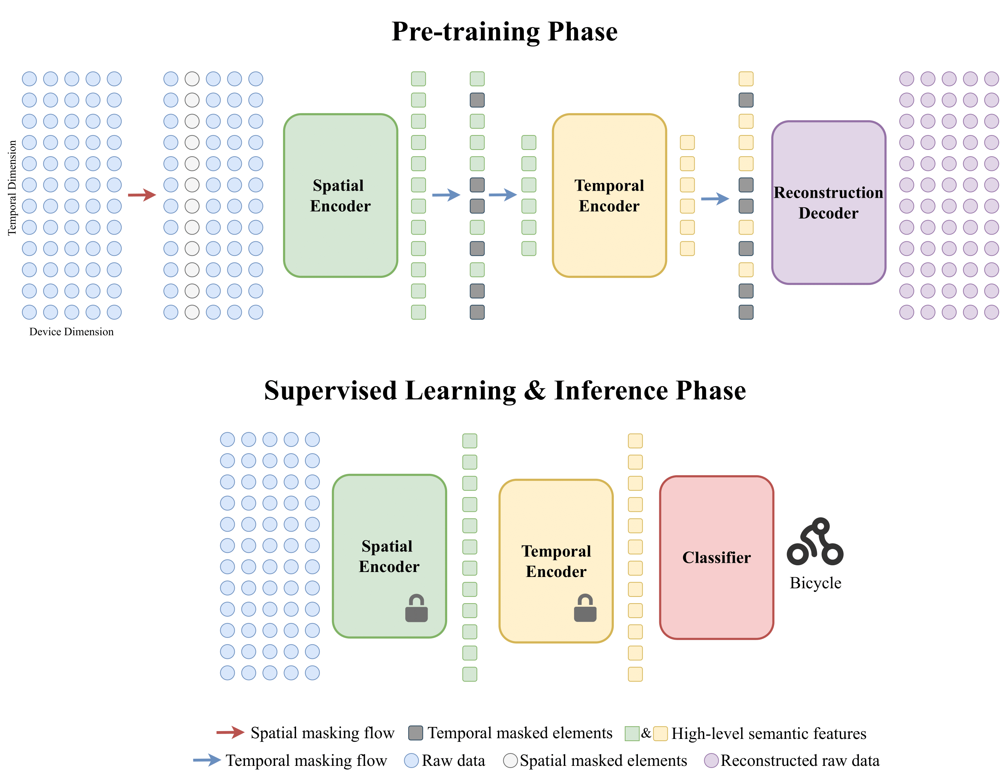

# 1 STMAE
This is the official implementation of paper ["Spatial-Temporal Masked Autoencoder for Multi-Device Wearable Human Activity Recognition"](https://doi.org/10.1145/3631415). Accepted by PACM IMWUT / UbiComp 2024.

The widespread adoption of wearable devices has led to a surge in the development of multi-device wearable human activity recognition (WHAR) systems. Despite the promise of self-supervised learning (SSL) in WHAR, the majority of studies have not considered missing device scenarios in multi-device WHAR. To bridge this gap, we propose a multi-device SSL WHAR method termed Spatial-Temporal Masked Autoencoder (STMAE). STMAE captures discriminative activity representations by utilizing the asymmetrical encoder-decoder structure and two-stage spatial-temporal masking strategy, which can exploit the spatial-temporal correlations in multi-device data to improve the performance of SSL WHAR, especially on missing device scenarios.

<p align="center">
  
</p>
 
# 2 Data Preparation

For your convenience, the preprocessed data is provided [here](https://drive.google.com/drive/folders/1_MiEfICh-T2cc3I8_LwWvY0xvb-C4MsJ?usp=sharing).

- Put the preprocessed data into the following directory structure
 ```python
- dataset/
  - opp/
    - opp_30_60/
       ... # preprocessed data of Opportunity
  - realworld/
    - realworld_50_150/
       ... # preprocessed data of RealWorld
  - realdisp/
    - realdisp_50_150/
       ... # preprocessed data of Realdisp
  - pamap/
    - pamap_100_300/
       ... # preprocessed data of PAMAP
  ```  
Links of raw datasets:
 - OPPORTUNITY:  https://archive.ics.uci.edu/ml/datasets/OPPORTUNITY+Activity+Recognition
 - RealWorld: https://sensor.informatik.uni-mannheim.de
 - Realdisp: https://archive.ics.uci.edu/ml/datasets/REALDISP+Activity+Recognition+Dataset
 - PAMAP: https://archive.ics.uci.edu/dataset/231/pamap2+physical+activity+monitoring

# 4 Training & Testing

Here is the descriptions about the arguments:
| Argument| Description |
| --- | --- |
| test_user | Test user (default=[0]) |
| dataset | Dataset name (default='opp') |
| gpu | Set specific GPU (default=None) |
| model_file | Pretrain model file (default=None) |
| label_index | Label index (default=23) |
| seed | Seed (default=1) |
| save_model | The saved model name (default='model') |

You can change the config depending on what you want:
```python
python main.py --test_user <test_user>  --dataset <dataset> --gpu <gpu>  --model_file <model_file>  --label_index <label_index> --seed <seed> --save_model <save_model>
```

# 5 Citation

If you find this work useful, please consider to cite as follows:

    @article{miao2023spatial,
        title={Spatial-temporal masked autoencoder for multi-device wearable human activity recognition},
        author={Miao, Shenghuan and Chen, Ling and Hu, Rong},
        journal={Proceedings of the ACM on Interactive, Mobile, Wearable and Ubiquitous Technologies},
        volume={7},
        number={4},
        pages={1--25},
        year={2023},
        publisher={ACM New York, NY, USA}
    }

# 6 Acknowledgements
  
The authors wish to thank the anonymous reviewers for their constructive comments on this work. This repo is based on [dapowan/LIMU-BERT-Public](https://github.com/dapowan/LIMU-BERT-Public) and [facebookresearch/mae](https://github.com/facebookresearch/mae). Great thanks to the original authors for their work.